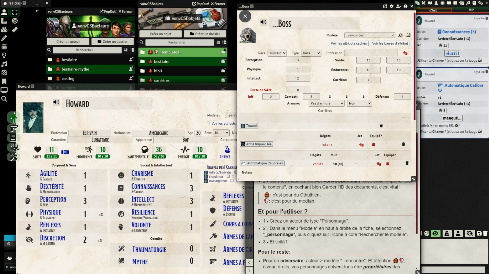

# Barbarians of R'Lyeh ! (CSB + BoL + Cthulhu)

## L'installer

https://gitlab.com/vonv/fvtt-csb-vonv-sys-bor/-/raw/main/module.json

- installer le système CSB: https://foundryvtt.com/packages/custom-system-builder
- installer ce module
- suivre le guide d'install dans le chat.

## Le système

Système opérationnel ! Qu'y a-t-il donc dedans ?

**système**

- basé sur CSB :slight_smile: sans autre module https://foundryvtt.com/packages/custom-system-builder
- on peut (dés)activer les flingues (via l'époque), le Mythe, et la magie
- mode édition pour désactiver certaines modifications de champs en jeu
- basé sur les règles de BoL: attribut [+carrière] [+/-(dés)avantages ou effets] + 2d6 >= 9

> dé bonus/malus (3d6, on garde les 2 meilleurs/pires)

> attribut corporel/sens: agilité, dextérité, perception, physique, réflexes, discrétion

> attribut social/intellectuel: charisme, connaissances, intellect, résilience (résistance à horreur/surnaturel), volonté

> attribut combat: agilité, dextérité, perception, physique, réflexes, discrétion

> attribut autres: thaumaturgie (magie), mythe (de Cthulhu)

- des jauges:

> santé (gestion auto des effets lorsque mal en point)

> endurance (gestion auto des effets lorsque fatigué)

> santé mentale

> énergie (magie)

> chance (héroïsme, destin,...)

> possibilité de gérer les effets de l'âge, d'une maladie,...

- les niveaux de certaines stats paramétrable directement dans un onglet "gardien" (sur chaque perso): max des jauges, difficulté des jets,...

**combat**

- postures: offensive, défense totale,...
- dégâts létaux/non-létaux
- dégâts gérant l'armure de la cible
- portées (pas sur la carte mais dans la fenêtre de jet)
- gestion des rafales (règle de Everywhen) et des cibles (une ou plusieurs)
- gestion des munitions et des chargeurs (plus de balles, on ne peut plus tirer :))
- armure (portée ou non), bouclier, casque (gestion auto de malus éventuels)

**chance**

- options escamotables et dispos que s'il vous reste de la chance
- regain de santé/endurance/santé mentale
- annulation auto des derniers dégâts
- coup dévastateur en combat (plus de dégâts)
